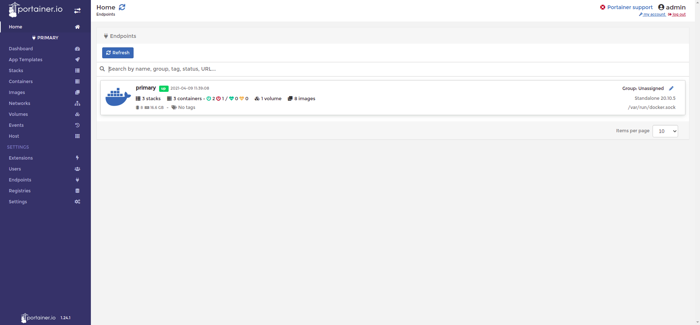
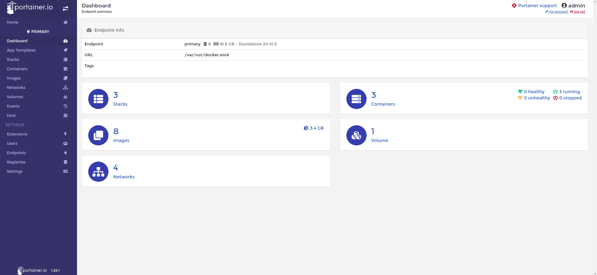
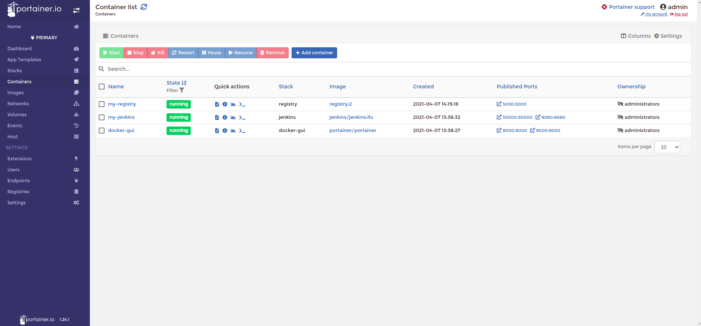

# jenkins-from-git-to-docker-registry
Purpose: This project is useful for someone who wants to deploy his docker-app with the following flow :
- push to git repository
- Jenkins pipeline:
  - initialize environment
  - stage: __fetch__
    - fetch new changes/version
  - stage: __build__  
    - build a new image
    - push a new version of the image in your private registry
  - stage: __test__
    - test application
  - stage: __deploy__
    - pull latest docker image
    - deploy it on host

Flexibility: The good news is that these jobs can easily be developed in multiple hosts since we expose ports in our registry, Jenkins containers and be accessed by anyone in these hosts. But also, can be isolated inside a docker network and not accessed at all if we keep the ports closed, and use only portainer as an interface to this network, or another application.
### Step 1: Create docker bridge network
A docker network as in the directory [network](network). You can customize it under your preferences.
```bash
sh create_main_bridge_network.sh
```
### Step 2: Run a docker GUI
```bash
cd docker-gui
docker-compose up -d
```
Open on [localhost:9000](localhost:9000) and create your user

[Portainer](https://www.portainer.io/) is a free, user-friendly management tool for docker.
### Step 3: Run your private registry
Follow the instructions in [ReadMe file](registry/Readme.md) under the directory [registry](registry).
```bash
cd registry
docker-compose up -d
```
### Step 4: Run Jenkins
Run Jenkins as a docker container under the [Jenkins](jenkins) directory.
```bash
cd jenkins
docker-compose up -d
```
_You may also check **all_up.sh** and **all_down.sh** scripts_
### Step 5: Verify that all is up and running
- Open [docker-gui](localhost:9000)
You should see the images below:
- 

- 

- 
### Step 6: Create a jenkins pipeline
Follow the instructions in [ReadMe file](Jenkins/Readme.md) under the directory [Jenkins](Jenkins).
